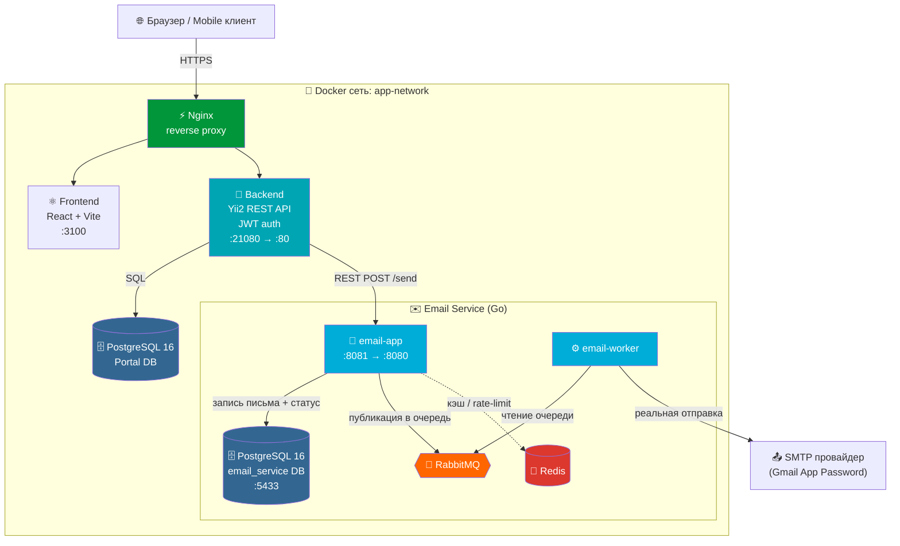
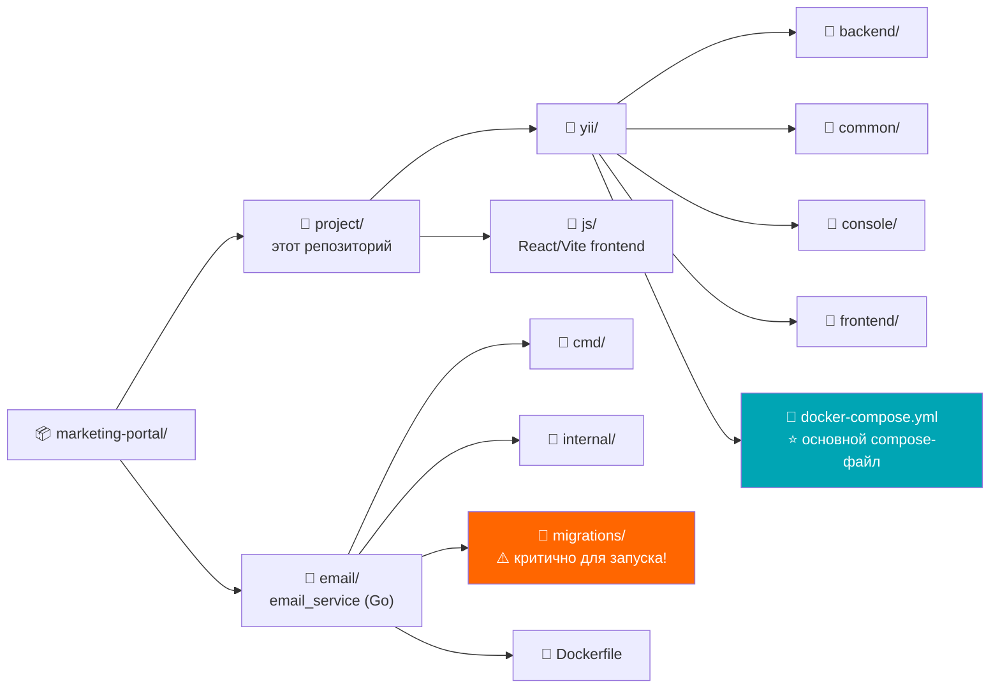
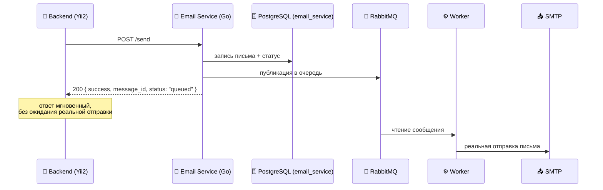

# 🎓 University Marketing Portal — Backend API


Бэкенд-часть портала для управления факультетами, студентами и email-рассылками университета.
REST API на **Yii2** (advanced template) с JWT-аутентификацией, ролевой моделью доступа и асинхронной интеграцией с отдельным микросервисом рассылки писем. Запускается через **Docker Compose** вместе с фронтендом, PostgreSQL и Email Service.

Проект реализован как заказная разработка: ниже — не только инструкция по запуску, но и обоснование архитектурных решений, принятых в ходе работы.

---

## 🧭 Архитектура системы



## 🧱 Стек и архитектурные решения

| Область | Решение | Почему |
|---|---|---|
| 🔌 API-слой | Yii2 REST (`yii\rest\ActiveController` + кастомные контроллеры) | Готовые CRUD-паттерны для типовых сущностей (факультеты, студенты) не мешают писать кастомную логику там, где она нужна (роли, email) |
| 🔐 Аутентификация | Stateless JWT (`HttpBearerAuth`) | Backend отдаёт чистый REST API для внешнего фронтенда/мобильного клиента — сессии на cookie здесь не подходят |
| 🛡️ Авторизация | Ролевая модель на уровне контроллеров (`super_admin` / `supervisor` / `worker`) | Явная проверка прав в экшенах вместо RBAC-дерева Yii2 — проще читать и тестировать при текущем размере проекта |
| 🗄️ БД | PostgreSQL 16 (в Docker) | Замена изначального MySQL/MAMP на Postgres для унификации со стеком Email Service, который тоже на Postgres |
| ✉️ Email-рассылки | Отдельный микросервис на Go ([email_service](https://github.com/asilbekerdonov/email_service)), а не встроенный `yii\mail\Mailer` | Отправка писем — I/O-тяжёлая операция с внешней зависимостью (SMTP). Вынесена в отдельный сервис с собственной очередью (RabbitMQ) и БД, чтобы отправка не блокировала запрос и не роняла Portal при недоступности почтового провайдера |
| 🔗 Межсервисное взаимодействие | REST поверх HTTP, с планом миграции критичных вызовов на gRPC | На старте — простота и скорость интеграции; gRPC-контракт уже спроектирован для будущего перехода без изменения бизнес-логики |
| ⚡ Reverse proxy | Nginx (перед backend/frontend) | Единая точка входа для стека: терминирует запросы, проксирует статику фронтенда и API-запросы к backend'у, снимает с Apache/PHP задачу отдачи статики |
| 🐳 Оркестрация | Docker Compose (frontend, backend, nginx, postgres, email-app, email-worker, email_postgres, rabbitmq, redis) | Единая команда `docker-compose up -d` поднимает весь стек локально, без ручной установки PHP/MySQL/Go/RabbitMQ/Nginx на машине разработчика |

---

## 📁 Структура репозиториев (важно!)

Проект состоит из **двух независимых репозиториев**, которые ожидаются рядом друг с другом на диске:



> **Перед первым запуском убедитесь, что оба репозитория склонированы и лежат именно в таком относительном расположении друг к другу** (либо поправьте пути в `volumes:` секции `docker-compose.yml`, см. раздел «Деплой на новый хост» ниже).

---

## ✅ Требования

- Docker и Docker Compose
- Git

> PHP, Composer, PostgreSQL, Go, RabbitMQ, Redis — устанавливать вручную **не нужно**, всё поднимается в контейнерах.

---

## 🚀 Установка и запуск (Docker)

### 1. Клонирование обоих репозиториев

```bash
mkdir marketing-portal && cd marketing-portal
git clone <URL_репозитория_backend_и_frontend> project
git clone https://github.com/asilbekerdonov/email_service email
```

### 2. Переменные окружения

Проверьте/поправьте в `project/yii/docker-compose.yml`:

| Переменная | Назначение |
|---|---|
| `DB_DSN`, `DB_USERNAME`, `DB_PASSWORD` | данные подключения к Postgres backend'а |
| `EMAIL_SERVICE_URL` | адрес Email Service внутри docker-сети (`http://email-app:8080`) |
| `SMTP_USER` / `SMTP_PASS` (в `email-app` и `email_worker`) | реальные SMTP-креды (Gmail App Password, не обычный пароль аккаунта) |
| `jwt.secret` (`backend/config/main.php`) | замените плейсхолдер на реальный секрет (см. раздел «Секреты») |

### 3. Путь к миграциям Email Service

В `docker-compose.yml`, в сервисе `email_postgres`, должен быть смонтирован каталог миграций Email Service:

```yaml
email_postgres:
  image: postgres:16-alpine
  container_name: yii2_email_postgres
  environment:
    POSTGRES_DB: email_service
    POSTGRES_USER: app
    POSTGRES_PASSWORD: app123
  ports:
    - "5433:5432"
  volumes:
    - email_postgres_data:/var/lib/postgresql/data
    - ../../email/migrations:/docker-entrypoint-initdb.d
  healthcheck:
    test: ["CMD-SHELL", "pg_isready -U app"]
    timeout: 5s
    retries: 10
  networks:
    - app-network
```

> ⚠️ **Этот маунт критичен.** Postgres выполняет `.sql`-файлы из `/docker-entrypoint-initdb.d` **только один раз, при первом старте на пустом volume**. Без этого маунта база `email_service` поднимется без единой таблицы, и любая отправка письма упадёт с 500 (`pq: relation "emails" does not exist`).
>
> Путь `../../email/migrations` считается **относительно расположения `docker-compose.yml`**, который вы реально запускаете (то есть от `project/yii/docker-compose.yml` — на два уровня вверх, в соседний репозиторий `email/`). Если структура папок на вашей машине отличается — пересчитайте относительный путь под неё.

### 4. Поднять весь стек

Из `project/yii/`:

```bash
docker-compose up -d --build
```

Первый запуск дольше обычного — собираются образы backend (`Dockerfile`) и накатываются как Yii2-миграции (`php yii migrate`, запускается автоматически из `Dockerfile` backend'а), так и SQL-миграции Email Service (из смонтированной папки).

Backend Postgres-миграции создадут:
- 👤 супер-администратора (`admin@marketing.local` / `ChangeMe123!` — **смените пароль после первого входа**);
- 🏛️ 12 факультетов-заглушек.

### 5. Проверка, что всё поднялось

```bash
docker-compose ps
```

Все сервисы должны быть в статусе `running`/`healthy`:

| Контейнер | Роль |
|---|---|
| `yii2_postgres` | 🗄️ БД Portal |
| `yii2_backend` | 🐘 Yii2 REST API |
| `yii2_nginx` | ⚡ Reverse proxy |
| `yii-frontend-1` | ⚛️ React/Vite |
| `yii2_email_postgres` | 🗄️ БД Email Service |
| `yii2_email_app` | 📨 Email API |
| `yii2_email_worker` | ⚙️ Воркер отправки |
| `yii2_rabbitmq` | 🐰 Очередь |
| `yii2_redis` | 🔴 Кэш |

Проверить, что в `email_service` реально создались таблицы (особенно после первого запуска):

```bash
docker-compose exec email_postgres psql -U app -d email_service -c '\dt'
```

Ожидаются: `emails`, `email_statuses`, `email_logs`, `email_stats` (плюс партиции `emails_p...`).

**Frontend:** `http://localhost:3100`
**Backend API:** `http://localhost:21080` (внутри контейнера — порт 80, наружу проброшен на 21080)

---

## 🔍 Проверка работы

### Логин

```bash
curl -X POST http://localhost:21080/v1/auth/login \
  -H "Content-Type: application/json" \
  -d '{"email":"admin@marketing.local","password":"ChangeMe123!"}'
```

Ответ содержит `access_token` — используйте его в заголовке `Authorization: Bearer <token>` для последующих запросов.

### Получение списка факультетов

```bash
curl -H "Authorization: Bearer <token>" http://localhost:21080/v1/faculties
```

---

## 🛡️ Ролевая модель доступа

| Роль | Описание |
|---|---|
| 👑 `super_admin` | Полный доступ, конфигурация системы, управление факультетами |
| 🧑‍💼 `supervisor` | Управление профилями студентов (расширенные права) |
| 🧑‍💻 `worker` | Создание/редактирование/удаление профилей студентов |

Проверка роли выполняется явно в экшенах контроллеров (см. `FacultyController::checkSuperAdmin()` и аналоги) — решение сознательно выбрано вместо встроенного Yii2 RBAC с деревом разрешений, так как при текущем наборе из трёх ролей и десятка эндпоинтов явная проверка читается быстрее при код-ревью и не требует отдельной миграции для хранения правил.

---

## 📡 API-эндпоинты

| Метод | Роут | Доступ |
|---|---|---|
| `POST` | `/v1/auth/login` | 🌍 Публичный |
| `GET` | `/v1/faculties` | 🔓 Любой авторизованный |
| `POST` | `/v1/faculties` | 👑 Только `super_admin` |
| `PUT` | `/v1/faculties/<id>` | 👑 Только `super_admin` |
| `DELETE` | `/v1/faculties/<id>` | 👑 Только `super_admin` |
| `GET` | `/v1/faculties/<id>/students` | 🔓 Любой авторизованный |
| `POST` | `/v1/faculties/<id>/students` | 🛡️ Согласно правам `StudentController` |
| `DELETE` | `/v1/students/<id>` | 🛡️ Согласно правам `StudentController` |
| `GET` | `/v1/email/health` | 🌍 Публичный |
| `POST` | `/v1/email/send` | ⚠️ Публичный* |
| `GET` | `/v1/email/status/<id>` | ⚠️ Публичный* |

\* см. раздел «Известные ограничения» ниже — для продакшена эти три роута нужно закрыть аутентификацией.

---

## ✉️ Интеграция с Email Service

Один из ключевых архитектурных вопросов проекта: как отправлять письма (уведомления о зачислении, рассылки факультетам), не завязывая Portal напрямую на SMTP и не блокируя HTTP-запрос на время отправки.

Решение — вынести отправку в отдельный микросервис на Go ([email_service](https://github.com/asilbekerdonov/email_service)), общающийся с Portal по REST, с собственной очередью и БД.

### Поток данных



Запрос к Portal возвращает `{"success":true,"message_id":"...","status":"queued"}` сразу, до реальной отправки — сама отправка асинхронная, через воркер Email Service, читающий очередь RabbitMQ. Это значит, что временная недоступность SMTP-провайдера не приводит к таймауту или ошибке на стороне Portal — письмо просто ждёт своей очереди.

### Взаимодействие внутри Docker-сети

Внутри одной docker-сети (`app-network`) контейнеры общаются по именам сервисов, а не по `localhost`:

- Backend обращается к Email Service по `http://email-app:8080` (переменная `EMAIL_SERVICE_URL`).
- Наружу (с хост-машины) Email Service доступен на `http://localhost:8081` — прокинуто в `email/docker-compose.yml` для standalone-тестирования сервиса в отрыве от Portal.

Компонент `emailClient` (`common\components\email\EmailClient`) реализован на встроенном `curl`, без дополнительных composer-зависимостей — сознательный выбор в пользу минимальной поверхности для поддержки, раз клиент делает буквально три HTTP-вызова.

### Проверка

```bash
# Health check Email Service через Portal
curl http://localhost:21080/v1/email/health

# Отправка письма
curl -X POST http://localhost:21080/v1/email/send \
  -H "Content-Type: application/json" \
  -d '{"to":"test@example.com","subject":"Test","body":"Hello"}'

# Статус конкретного письма по ID
curl http://localhost:21080/v1/email/status/1
```

---

## 🧪 Тесты

```bash
docker-compose exec backend vendor/bin/phpunit common/tests/Unit/Models
```

---

## 🧰 Деплой на новый хост / смену окружения — чеклист

**Обязательно пройтись по этому списку при переносе на новый сервер, VPS, staging/production окружение.** Каждый пункт — реальная причина падения на предыдущих итерациях этого проекта, зафиксировано намеренно для следующего разработчика/ИИ, чтобы не проходить путь диагностики заново.

- [ ] **`VITE_API_BASE_URL`** (сервис `frontend` в `docker-compose.yml`) — должен указывать на адрес, доступный **из браузера пользователя**, а не из docker-сети.
  - Локально с прокси через Vite — используйте относительный путь: `VITE_API_BASE_URL=/api` (см. `js/vite.config.ts`, там уже настроен `proxy` на `backend:80`).
  - **Никогда** не указывайте здесь имя docker-контейнера (`http://backend:80/api`) — оно резолвится только внутри docker-сети. Браузер отрапортует это как "CORS заблокирован" / `NetworkError`, хотя причина в недостижимом DNS-имени.
  - На реальном сервере — публичный домен/IP backend'а, например `https://api.yourdomain.com/api`.

- [ ] **CORS-конфигурация.** `Access-Control-Allow-Credentials: true` **нельзя** сочетать с `Origin: ['*']` — `yii\filters\Cors` выбросит `InvalidConfigException` на первом же preflight-запросе. В этом проекте авторизация — Bearer-токен в памяти (не cookie), credentials не нужны: держите `Access-Control-Allow-Credentials: false`. Настройки — в `backend/config/main.php` (`as cors`) и в `EmailController::behaviors()`. Если в будущем понадобятся cookie-based credentials — заменить wildcard на конкретный origin.

- [ ] **`EMAIL_SERVICE_URL`** (backend) — внутри одной docker-сети используйте имя контейнера (`http://email-app:8080`); между разными хостами/сетями — публичный или внутрисетевой адрес Email Service.

- [ ] **Путь к `email/migrations` в volume `email_postgres`.** Относительный путь (`../../email/migrations`) считается от расположения `docker-compose.yml`. При переносе на сервер, где структура папок отличается, путь нужно пересчитать — иначе Postgres поднимется без таблиц, и любая отправка письма упадёт с `pq: relation "emails" does not exist`.
  - Если volume для `email_postgres_data` уже был создан пустым (например, маунт добавили постфактум), Docker **не** применит миграции повторно — нужно удалить volume и поднять контейнер заново:
    ```bash
    docker-compose stop email_postgres
    docker-compose rm -f email_postgres
    docker volume ls | grep email_postgres   # найти точное имя (с префиксом папки проекта)
    docker volume rm <имя_volume>
    docker-compose up -d email_postgres
    docker-compose exec email_postgres psql -U app -d email_service -c '\dt'
    ```

- [ ] **`jwt.secret`** (`backend/config/main.php`) — сгенерировать новый секрет (минимум 32 символа), не использовать плейсхолдер из репозитория. Вынести в `common/config/main-local.php` (не версионируется) или переменные окружения.

- [ ] **`SMTP_USER` / `SMTP_PASS`** — реальные креды (для Gmail — App Password, а не пароль аккаунта; требует включённой 2FA на аккаунте).

- [ ] **Аутентификация `/v1/email/*`** — перед продакшеном закрыть эти три роута (`HttpBearerAuth`), см. «Известные ограничения» ниже.

---

## 📌 Известные ограничения и планы развития

Честно фиксирую, что осталось за рамками текущей итерации — как ориентир для дальнейшей работы:

- **🔓 Аутентификация `/v1/email/*`.** Сейчас эти три роута публичные — для продакшена нужно добавить `HttpBearerAuth` в `EmailController::behaviors()` по аналогии с `FacultyController`, чтобы отправку писем нельзя было инициировать анонимно.
- **🔁 Идемпотентность отправки.** При ретраях на сетевом уровне (таймаут между Portal и Email Service) возможна повторная постановка одного письма в очередь. Решение — idempotency-key на стороне Email Service, спроектировано, но не реализовано в этой итерации.
- **🔗 gRPC вместо REST для межсервисного вызова.** Контракт (`email.proto`) спроектирован заранее, чтобы переход не потребовал переписывания бизнес-логики — сейчас использован REST как более быстрый путь для MVP.
- **🔑 Секреты в конфигах.** `jwt.secret` в `backend/config/main.php` — пример-плейсхолдер; в реальном деплое должен браться из переменных окружения или `main-local.php` (не версионируемого).
- **💾 Персистентность JWT на фронтенде.** Токен хранится только в памяти (module-level переменная в `api/client.ts`), теряется при полной перезагрузке страницы — это осознанное временное решение; стратегия с httpOnly refresh-cookie вынесена в отдельную задачу.